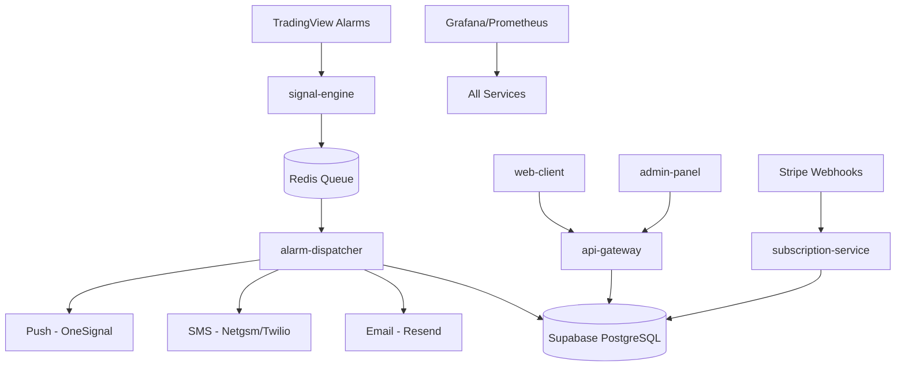
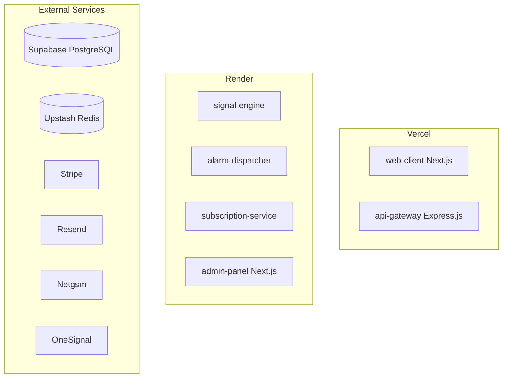

# Design Document

## Overview

The crypto signal platform is designed as a microservices architecture that processes TradingView webhook signals and delivers notifications to users across multiple channels. The system emphasizes reliability, scalability, and cost-effectiveness while maintaining security and compliance standards.

The platform consists of six core services: signal-engine (webhook processing), alarm-dispatcher (notification delivery), api-gateway (user-facing API), subscription-service (billing management), admin-panel (configuration interface), and web-client (user portal). These services communicate through Redis queues and share a PostgreSQL database.

## Architecture

### High-Level Architecture



### Service Communication

- **Synchronous**: REST APIs between web clients and api-gateway
- **Asynchronous**: BullMQ jobs through Redis for signal processing
- **Event-driven**: Webhook callbacks from external services (TradingView, Stripe)
- **Database**: Shared PostgreSQL instance with service-specific schemas

### Deployment Architecture



## Components and Interfaces

### 1. Signal Engine

**Purpose**: Receives and validates TradingView webhook payloads, queues signal processing jobs.

**Technology Stack**: Express.js, BullMQ, Upstash Redis

**Key Interfaces**:
```typescript
// Webhook endpoint
POST /webhook/tradingview
Content-Type: application/json
{
  "symbol": "BTCUSDT",
  "timeframe": "1h",
  "action": "buy" | "sell",
  "price": 45000.50,
  "timestamp": "2024-01-15T10:30:00Z",
  "strategy": "UT_Bot",
  "parameters": {
    "ema_period": 9,
    "atr_period": 10,
    "multiplier": 3.7
  }
}

// Queue job structure
interface SignalJob {
  id: string;
  payload: WebhookPayload;
  timestamp: Date;
  retryCount: number;
}
```

**Validation Logic**:
- Verify webhook signature/token
- Validate required fields and data types
- Check symbol and timeframe format
- Ensure price and timestamp validity

### 2. Alarm Dispatcher

**Purpose**: Processes queued signals, matches user alarms, manages credits, and triggers notifications.

**Technology Stack**: Express.js, BullMQ, Prisma, notification providers

**Key Interfaces**:
```typescript
// Signal processing workflow
interface AlarmMatch {
  userId: string;
  alarmId: string;
  notificationChannels: ('email' | 'sms' | 'push')[];
  userCredits: number;
}

// Notification payload
interface NotificationPayload {
  userId: string;
  signal: ProcessedSignal;
  channels: NotificationChannel[];
  template: string;
}
```

**Processing Logic**:
1. Consume signal jobs from Redis queue
2. Query active alarms matching signal criteria
3. Check user subscription status and credit balance
4. Deduct credits and queue notification jobs
5. Handle delivery failures with retry logic

### 3. API Gateway

**Purpose**: Provides REST API for web clients, handles authentication and authorization.

**Technology Stack**: Express.js, Prisma, Supabase JWT

**Key Endpoints**:
```typescript
// Authentication middleware
GET /api/auth/user
Authorization: Bearer <supabase_jwt>

// Alarm management
GET /api/alarms
POST /api/alarms
PUT /api/alarms/:id
DELETE /api/alarms/:id

// User account
GET /api/account/profile
GET /api/account/credits
GET /api/account/history

// Subscription management
GET /api/subscriptions/plans
POST /api/subscriptions/checkout
GET /api/subscriptions/status
```

**Security Middleware**:
- JWT token validation
- Rate limiting (100 requests/minute per user)
- Request sanitization
- CORS configuration

### 4. Subscription Service

**Purpose**: Manages user subscriptions, processes Stripe webhooks, handles credit allocation.

**Technology Stack**: Express.js, Prisma, Stripe SDK

**Key Interfaces**:
```typescript
// Stripe webhook handler
POST /webhook/stripe
Stripe-Signature: <webhook_signature>

// Credit management
interface CreditTransaction {
  userId: string;
  amount: number;
  type: 'purchase' | 'usage' | 'refund';
  description: string;
  timestamp: Date;
}

// Subscription plans
interface SubscriptionPlan {
  id: string;
  name: string;
  credits: number;
  price: number;
  interval: 'month' | 'year';
  features: string[];
}
```

### 5. Admin Panel

**Purpose**: Configuration interface for UT Bot parameters, system monitoring, and analytics.

**Technology Stack**: Next.js, Shadcn/ui, Tailwind CSS

**Key Features**:
- UT Bot parameter configuration with Pine Script generation
- Real-time queue monitoring and metrics
- User management and support tools
- System health dashboard
- Signal delivery analytics

### 6. Web Client

**Purpose**: User-facing portal for alarm management, account settings, and notification history.

**Technology Stack**: Next.js, Tailwind CSS, Supabase SDK

**Key Features**:
- User registration and authentication
- Alarm creation and management
- Subscription and billing management
- Notification history and preferences
- Account settings and profile management

## Data Models

### Core Entities

```sql
-- Users table (managed by Supabase Auth)
CREATE TABLE users (
  id UUID PRIMARY KEY DEFAULT gen_random_uuid(),
  email VARCHAR(255) UNIQUE NOT NULL,
  created_at TIMESTAMP DEFAULT NOW(),
  updated_at TIMESTAMP DEFAULT NOW()
);

-- User profiles
CREATE TABLE user_profiles (
  user_id UUID PRIMARY KEY REFERENCES users(id),
  display_name VARCHAR(100),
  notification_preferences JSONB,
  timezone VARCHAR(50) DEFAULT 'UTC',
  created_at TIMESTAMP DEFAULT NOW(),
  updated_at TIMESTAMP DEFAULT NOW()
);

-- UT Bot configurations
CREATE TABLE ut_bot_configs (
  id UUID PRIMARY KEY DEFAULT gen_random_uuid(),
  symbol VARCHAR(20) NOT NULL,
  timeframe VARCHAR(10) NOT NULL,
  ema_period INTEGER NOT NULL,
  atr_period INTEGER NOT NULL,
  multiplier DECIMAL(4,2) NOT NULL,
  pine_script TEXT,
  webhook_url VARCHAR(500),
  is_active BOOLEAN DEFAULT true,
  created_at TIMESTAMP DEFAULT NOW(),
  UNIQUE(symbol, timeframe)
);

-- User alarms
CREATE TABLE user_alarms (
  id UUID PRIMARY KEY DEFAULT gen_random_uuid(),
  user_id UUID NOT NULL REFERENCES users(id),
  config_id UUID NOT NULL REFERENCES ut_bot_configs(id),
  notification_channels TEXT[] NOT NULL,
  is_active BOOLEAN DEFAULT true,
  created_at TIMESTAMP DEFAULT NOW(),
  updated_at TIMESTAMP DEFAULT NOW()
);

-- Subscription plans
CREATE TABLE subscription_plans (
  id VARCHAR(50) PRIMARY KEY,
  name VARCHAR(100) NOT NULL,
  credits INTEGER NOT NULL,
  price_cents INTEGER NOT NULL,
  interval VARCHAR(20) NOT NULL,
  features JSONB,
  is_active BOOLEAN DEFAULT true
);

-- User subscriptions
CREATE TABLE user_subscriptions (
  id UUID PRIMARY KEY DEFAULT gen_random_uuid(),
  user_id UUID NOT NULL REFERENCES users(id),
  plan_id VARCHAR(50) NOT NULL REFERENCES subscription_plans(id),
  stripe_subscription_id VARCHAR(100),
  status VARCHAR(20) NOT NULL,
  current_period_start TIMESTAMP,
  current_period_end TIMESTAMP,
  created_at TIMESTAMP DEFAULT NOW(),
  updated_at TIMESTAMP DEFAULT NOW()
);

-- Credit transactions
CREATE TABLE credit_transactions (
  id UUID PRIMARY KEY DEFAULT gen_random_uuid(),
  user_id UUID NOT NULL REFERENCES users(id),
  amount INTEGER NOT NULL,
  transaction_type VARCHAR(20) NOT NULL,
  description TEXT,
  reference_id VARCHAR(100),
  created_at TIMESTAMP DEFAULT NOW()
);

-- Signal history
CREATE TABLE signal_history (
  id UUID PRIMARY KEY DEFAULT gen_random_uuid(),
  config_id UUID NOT NULL REFERENCES ut_bot_configs(id),
  signal_data JSONB NOT NULL,
  processed_at TIMESTAMP DEFAULT NOW(),
  affected_users INTEGER DEFAULT 0
);

-- Notification history
CREATE TABLE notification_history (
  id UUID PRIMARY KEY DEFAULT gen_random_uuid(),
  user_id UUID NOT NULL REFERENCES users(id),
  signal_id UUID NOT NULL REFERENCES signal_history(id),
  channel VARCHAR(20) NOT NULL,
  status VARCHAR(20) NOT NULL,
  delivered_at TIMESTAMP,
  error_message TEXT,
  created_at TIMESTAMP DEFAULT NOW()
);
```

### Indexes and Performance

```sql
-- Performance indexes
CREATE INDEX idx_user_alarms_user_active ON user_alarms(user_id, is_active);
CREATE INDEX idx_user_alarms_config_active ON user_alarms(config_id, is_active);
CREATE INDEX idx_signal_history_config_time ON signal_history(config_id, processed_at);
CREATE INDEX idx_notification_history_user_time ON notification_history(user_id, created_at);
CREATE INDEX idx_credit_transactions_user_time ON credit_transactions(user_id, created_at);
```

## Error Handling

### Error Categories and Responses

1. **Webhook Validation Errors**
   - Invalid signature: Return 401, log security event
   - Malformed payload: Return 400, queue for manual review
   - Unknown symbol/timeframe: Return 422, alert administrators

2. **Processing Errors**
   - Database connection failure: Retry with exponential backoff
   - Queue service unavailable: Store in local buffer, retry when available
   - External API rate limits: Implement circuit breaker pattern

3. **Notification Delivery Errors**
   - Email delivery failure: Retry up to 3 times, fallback to alternative provider
   - SMS delivery failure: Switch to backup provider (Twilio)
   - Push notification failure: Mark as failed, don't retry

4. **User-Facing Errors**
   - Authentication failure: Return 401 with clear error message
   - Insufficient credits: Return 402 with upgrade options
   - Rate limit exceeded: Return 429 with retry-after header

### Error Recovery Strategies

```typescript
// Circuit breaker implementation
class CircuitBreaker {
  private failures = 0;
  private lastFailureTime = 0;
  private state: 'closed' | 'open' | 'half-open' = 'closed';
  
  async execute<T>(operation: () => Promise<T>): Promise<T> {
    if (this.state === 'open') {
      if (Date.now() - this.lastFailureTime > this.timeout) {
        this.state = 'half-open';
      } else {
        throw new Error('Circuit breaker is open');
      }
    }
    
    try {
      const result = await operation();
      this.onSuccess();
      return result;
    } catch (error) {
      this.onFailure();
      throw error;
    }
  }
}

// Retry with exponential backoff
async function retryWithBackoff<T>(
  operation: () => Promise<T>,
  maxRetries: number = 3
): Promise<T> {
  for (let attempt = 1; attempt <= maxRetries; attempt++) {
    try {
      return await operation();
    } catch (error) {
      if (attempt === maxRetries) throw error;
      
      const delay = Math.min(1000 * Math.pow(2, attempt - 1), 10000);
      await new Promise(resolve => setTimeout(resolve, delay));
    }
  }
}
```

## Testing Strategy

### Unit Testing
- **Coverage Target**: 80% minimum for business logic
- **Framework**: Jest with TypeScript support
- **Focus Areas**: Signal validation, credit calculations, notification formatting
- **Mocking**: External APIs, database connections, queue operations

### Integration Testing
- **Database Tests**: Real PostgreSQL instance with test data
- **Queue Tests**: Redis integration with BullMQ
- **API Tests**: End-to-end request/response validation
- **Webhook Tests**: Simulated TradingView and Stripe payloads

### End-to-End Testing
- **User Flows**: Registration, alarm creation, signal delivery
- **Payment Flows**: Subscription purchase, credit allocation
- **Admin Flows**: Configuration management, monitoring
- **Framework**: Playwright for web interface testing

### Performance Testing
- **Load Testing**: 1000 concurrent webhook requests
- **Stress Testing**: Queue processing under high volume
- **Endurance Testing**: 24-hour continuous operation
- **Tools**: Artillery.js for API load testing

### Security Testing
- **Authentication**: JWT token validation and expiration
- **Authorization**: Role-based access control
- **Input Validation**: SQL injection, XSS prevention
- **Rate Limiting**: DDoS protection effectiveness

### Monitoring and Observability

```typescript
// Metrics collection
interface SystemMetrics {
  webhookRequestsPerSecond: number;
  queueDepth: number;
  notificationDeliveryRate: number;
  errorRate: number;
  responseTime: number;
  activeUsers: number;
  creditConsumption: number;
}

// Health check endpoints
GET /health/live    // Kubernetes liveness probe
GET /health/ready   // Kubernetes readiness probe
GET /health/metrics // Prometheus metrics endpoint
```

### Alerting Rules
- Queue depth > 1000 messages
- Error rate > 5% over 5 minutes
- Response time > 2 seconds (95th percentile)
- External service failure rate > 10%
- Credit consumption anomalies
- Failed webhook deliveries > 50/hour